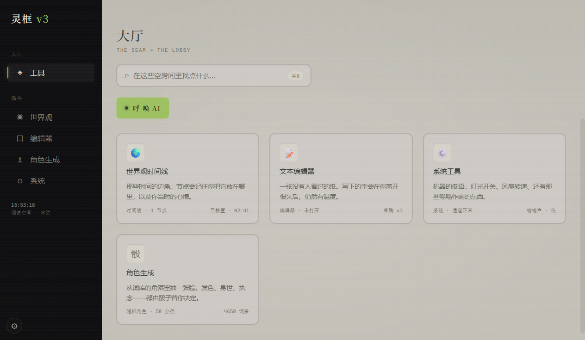

# 灵框 LingKuang v3

[](LICENSE)
[](https://github.com/orvyn-glitch/lingkuang/releases)
[](package.json)

**阈限梦核（Liminal Dreamcore）世界观工作台** —— 一个自带氛围的创作工具：时间线、角色生成、词义联想图，都住在一条褪色的走廊里。

> 视觉语言：暖灰米底、冷荧光绿点缀、内凹壁龛、VHS 颗粒。它不是"工具"，是一间废弃大厅。



---

## ✨ 特性

| 模块 | 说明 |
|---|---|
| 🕰️ **世界观时间线** | 横向节点图时间线：拖拽平移、Alt+滚轮缩放、多条循环（轮回）支持、节点关联人物/地点 |
| 🎲 **随机角色生成器** | 58 分类 / 4600+ 词条随机组合角色；每组词条数可选；词条可锁定（下次随机保留）；组合可保存/加载 |
| 🔗 **词义联想图** | 点词展开一级联想（本地 Ollama）；节点力导向布局（引斥力）、可拖动、子树跟随；选中支线收起同级；未入库词一键暂存导出 |
| 📝 **Markdown 编辑器** | 双栏实时预览，文稿列表管理 |
| 🌀 **AI 面板（The Hum）** | 常驻的呼吸灯，等你想起 |

## 🚀 安装运行

### 普通用户：直接下载，不用装任何环境

从 [Releases](https://github.com/orvyn-glitch/lingkuang/releases) 下载：

- `LingKuang-x.x.x-x64.exe` — 安装版（双击安装）
- `LingKuang-x.x.x-portable-x64.exe` — 便携版（双击即用，免安装）

不需要 Node.js / npm / 任何命令行。

### 开发者：源码运行

需要 **Node.js 18+**（含 npm）：

```bash
npm install
npm start
```

### 依赖说明

- **Electron**：`npm install` 自动安装
- **Ollama**（可选，仅联想图需要）：`qwen2.5:7b` 模型

### 启用词义联想（可选）

词义联想引擎支持**双模式**（设置 → 联想引擎）：

| 模式 | 说明 | 成本 |
|---|---|---|
| **本地 Ollama** | 安装 [Ollama](https://ollama.com) + `ollama pull qwen2.5:7b` | 免费（自付电费） |
| **OpenAI 兼容 API** | 设置里填 Base URL / API Key / 模型名（支持任意 OpenAI 兼容端点） | 按量付费（费用由提供商收取） |

也可用环境变量配置：`LINGKUANG_AI_MODE` / `LINGKUANG_AI_BASE_URL` / `LINGKUANG_AI_MODEL` / `LINGKUANG_AI_API_KEY`

> ⚠️ **免责声明**：灵框本体免费开源。AI 联想功能是**可选**能力——本地部署或第三方 API 的费用均由使用者自行承担，与灵框项目无关。未配置 AI 时，时间线 / 角色生成 / 编辑器等核心功能完全可用。

## 🎮 操作速览

**角色生成页**
- 随机生成 → 每组卡片右上角可选词条数（随机/1..4）
- 点词条右侧 `⚿` 锁定 → 下次随机保留
- 组合命名保存 → 点存档胶囊加载
- 联想图：**点词**展开一级联想 / **再点焦点**刷新（保留已选支线）/ **拖动节点**子树跟随 / **拖拽空白**平移 / **Alt+滚轮**缩放
- 虚线词 = 未入库 → 点「存」暂存 → 点「导出暂存词」写入词库（Ollama 自动分类）

**时间线页**
- 拖拽平移 / Alt+滚轮缩放 / 右键菜单增删节点
- 循环：创建循环框，绑定起止边界节点，支持多条循环

## 📂 目录结构

```
lingkuang-v3-ui/
├── main.js              # Electron 主进程（IPC：数据读写 / Ollama 联想 / 词库分类）
├── preload.js           # contextBridge 安全桥
├── lingkuang.js         # 渲染进程全部逻辑
├── index.html           # 单文件界面 + 样式（设计令牌内联）
├── mcp-server.js        # MCP 服务器（query_timeline / search_world 等）
├── data/
│   ├── worldbuilding.js # 世界观种子数据（示例）
│   └── character_lib.json  # 角色生成词库
└── design-system/       # 设计令牌与规范文档
```

## ⚠️ 词库声明

`data/character_lib.json` 角色生成词库基于**萌娘百科**（[CC BY-NC-SA 3.0](https://creativecommons.org/licenses/by-nc-sa/3.0/)）词条整理，并混有 AI 生成扩充词条。该词库**仅限非商业用途**，与代码的 MIT 协议相互独立。如需商用或自行分发，请替换为自建词库（编辑 JSON 即可，58 个分类 key 的结构见 `lingkuang.js` 的 `CHAR_GROUPS`）。

用户数据（时间线/设置/暂存词）保存在系统 `%APPDATA%\lingkuang\`，不随仓库分发。

## 📄 License

- 代码：**GPL-3.0**（见 [LICENSE](LICENSE)）
- 词库：**CC BY-NC-SA 3.0**（见上）

## 🧑‍💻 参与开发

- 📖 [代码地图](docs/ARCHITECTURE.md) — 先读这个（架构 / 数据模型 / 关键机制 / 设计约定）
- 🐛 [已知 Bug](docs/BUGS.md) — 未修复问题清单
- 🗺️ [功能路线图](docs/ROADMAP.md) — 愿景与待办，含拆分建议

## 📖 用户手册

- 🎮 [操作手册](docs/USER_GUIDE.md) — 时间线 / 角色生成 / 联想图 / 剧情范围 / 编辑器 完整操作说明

---

*"The Seam → The Lobby" — 走廊尽头的灯还亮着。*
